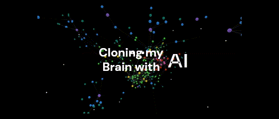
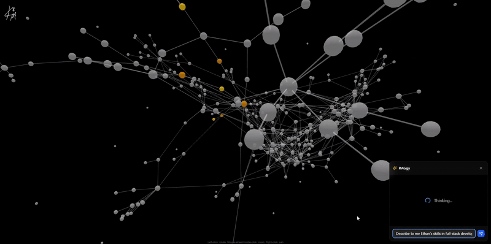
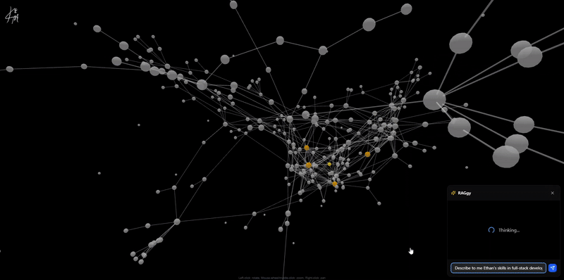
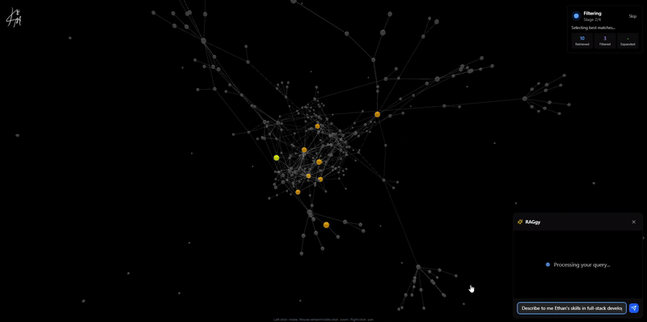
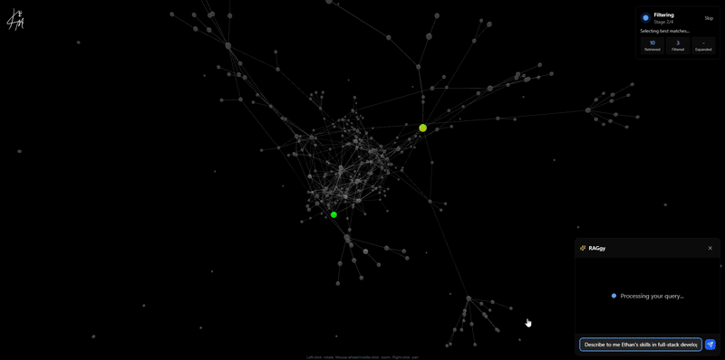
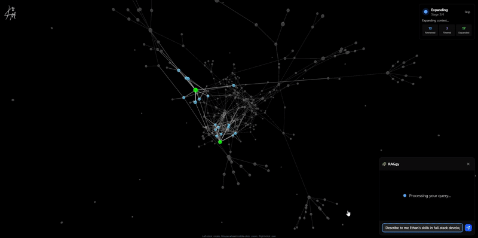

# Resume Graph Visualization - Ethan Markwalter's Interactive Portfolio

A comprehensive 3D graph visualization of professional profile data with intelligent RAG (Retrieval-Augmented Generation) pipeline for interactive resume analysis. This system represents Ethan Markwalter's professional journey as an interactive knowledge graph with AI-powered querying capabilities.



## 🌟 Features

- **3D Force-Directed Graph**: Interactive visualization of resume entities and relationships
- **Intelligent RAG Pipeline**: AI-powered query system with graph-based context expansion using Haystack
- **Real-time Animation**: Visual representation of AI reasoning process through 4 distinct stages
- **Multi-Entity Support**: Skills, experiences, education, projects, collaborators, and reading history
- **Dynamic Highlighting**: Category-based node highlighting and filtering
- **Relationship Mapping**: Visual connections between skills, projects, and experiences with weighted relationships
- **LLM-Powered Filtering**: OpenAI GPT-4o-mini for intelligent document selection and reasoning

## 🚀 Live Demo

 [Video Overview](https://www.linkedin.com/posts/ethan-markwalter_explainableai-ai-deeplearning-activity-7328473691221106688-Wdsc?utm_source=share&utm_medium=member_desktop&rcm=ACoAACmnwVYBAMW9NIHSbSRPXDYDeM9ZyUUAp9Y)

## 📊 Architecture Overview

### RAGgy AI Assistant
The system features "RAGgy" - an AI assistant that represents Ethan Markwalter and can answer questions about his professional background using the complete knowledge graph.

### Data Model
The system uses a comprehensive PostgreSQL schema with the following entities:

#### Core Entities
- **Endeavors**: Professional and personal experiences with titles, descriptions, dates, and categories
- **Knowledge**: Educational periods (academic years) with institutions and reflections
- **Classes**: Specific courses with terms, descriptions, and professor connections
- **Artifacts**: Projects, papers, and deliverables with completion dates and links
- **Skills**: Technical and hard skills with detailed descriptions
- **Characteristics**: Soft skills and personal attributes
- **Collaborators**: Mentors, professors, and project partners with LinkedIn profiles and types
- **Books**: Reading history with authors, reading order, reasons, and reflections

#### Relationship System
- **Contributions**: Weighted connections (1-10 scale) between skills/characteristics and endeavors/artifacts/classes
- **Many-to-Many Relations**: Collaborators connected to artifacts, endeavors, and classes
- **Hierarchical Links**: Classes connected to knowledge periods, artifacts to endeavors/classes

### Advanced RAG Pipeline (4-Stage Process)

#### Stage 0: Loading
- **Overview**: System accepts the user's query and activates the system
- **Animation**: Rotating pan around the graph as nodes randomly pulsate


#### Stage 1: Vector Retrieval
- **Embedder**: SentenceTransformers all-MiniLM-L6-v2 model
- **Top-K Retrieval**: InMemoryEmbeddingRetriever (top 10 matches)
- **Document Store**: Haystack InMemoryDocumentStore with pre-computed embeddings
- **Animation**: 
  - Highlights top 10 semantically similar documents
  - Shows embedding-based relevance matching



#### Stage 2: LLM-Powered Filtering
- **Model**: OpenAI GPT-4o-mini
- **Process**: Intelligent document relevance evaluation using custom prompt templates
- **Output**: Filtered document IDs with reasoning explanation
- **Fallback**: Robust parsing with multiple fallback strategies
- **Animation**: 
  - Displays intelligent document selection
  - Shows reasoning process from language model


#### Stage 3: Graph Context Expansion
- **Engine**: NetworkX graph traversal
- **Strategy**: Multi-level relationship expansion based on node types and connection weights
- **Logic**: 
  - Skills/characteristics always included
  - Endeavor connections to collaborators/artifacts
  - Knowledge connections to classes
  - Class connections to professors
  - Weight-based filtering (strength ≥ 3)
  - Second-level expansion for important nodes
- **Animation**: 
  - Visualizes relationship-based context expansion
  - Highlights connected entities and their strengths


#### Stage 4: Response Synthesis
- **Context Builder**: Structured narrative combining filtered documents and graph context
- **Prompt System**: ChatPromptBuilder with comprehensive context templates
- **Response**: Concise, advocate-style responses with specific examples
- **Animation**: 
  - Shows final document combination
  - Displays structured response delivery


### Visualization Engine
- **3D Force-Directed Graph**: Built with Three.js and d3-force-3d
- **Dynamic Node Sizing**: Based on connection count, total strength, and node type
- **Relationship Visualization**: Link opacity and width based on strength levels
- **Animated Highlighting**: Real-time visualization of RAG pipeline stages
- **Interactive Controls**: Zoom, pan, rotate, and node selection

## 🛠️ Tech Stack

### Backend (Python)
- **FastAPI** - REST API framework with CORS middleware
- **Haystack 2.13.1** - RAG pipeline orchestration
- **OpenAI GPT-4o-mini** - Language model for filtering and generation
- **SentenceTransformers 4.1.0** - Text embeddings
- **NetworkX 3.2.1** - Graph analysis and traversal
- **psycopg2** - PostgreSQL database connectivity
- **Pydantic** - Data validation and serialization

### Database
- **PostgreSQL** - Primary data store with comprehensive schema
- **Prisma ORM** - Database modeling and type-safe queries
- **Deployment**: Supabase (recommended) or self-hosted

### Frontend Integration
- **CORS Origins**: `localhost:3000`, `kem-web.netlify.app`
- **API Endpoints**: RESTful design with structured request/response models


## 🎨 Graph Data Structure

### Node Properties
```python
{
  "id": "cuid_string",           # Database ID
  "name": "Display Name",        # Title or name
  "group": "endeavor",           # Category type
  "val": 15.3,                   # Calculated size
  "nodeOpacity": 0.8,            # Visibility (0.3-1.0)
  "connectionCount": 5,          # Number of connections
  "totalStrength": 23,           # Sum of relationship weights
  
  # Additional properties based on type
  "description": "...",          # Entity description
  "startDate": "2023-01-01",     # For endeavors
  "term": "Fall 2023",           # For classes
  "collaboratorType": "mentor"   # For collaborators
}
```

### Link Properties
```python
{
  "source": "node_id_1",         # Source node
  "target": "node_id_2",         # Target node
  "value": 7,                    # Relationship strength (1-10)
  "strengthLevel": 7,            # Same as value
  "linkOpacity": 0.6,            # Calculated visibility
  "linkWidth": 3.5               # Calculated thickness
}
```


## 📄 License

This project is licensed under the MIT License - see the [LICENSE](LICENSE) file for details.

## 🙏 Acknowledgments

- **Haystack** by Deepset for RAG framework
- **OpenAI** for language model capabilities
- **NetworkX** for graph analysis
- **3d-force-graph** by Vasco Asturiano for visualization
- **FastAPI** for modern Python web framework

## 📞 Contact

**Ethan Markwalter** - [LinkedIn]([https://linkedin.com/in/ethanmarkwalter](https://www.linkedin.com/in/ethan-markwalter/))

